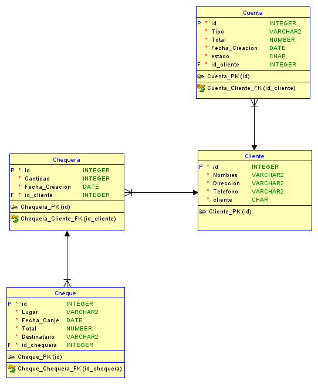

# Levantar la base de datos en docker

```
docker run -e "ACCEPT_EULA=Y" -e "MSSQL_SA_PASSWORD=Adrian3020!" -p 1433:1433 -d mcr.microsoft.com/mssql/server:2022-latest
```

# Modelo Entidad Relacion para el crud de banco


Se realizó este modelo para poder implementar las operaciones basicas para un crud enfocado a un banco.


En este escenario un cliente puede tener diferentes cuentas sin límite, al igual que puede poseer varias chequeras con cantidad diferente de cheques en ella.

<hr>

## He agregado la lista de endpoints utilizados en el json de Postman

<hr>

## Los scripts utilizados para la base de datos se encuentran en la carpeta "Entidad"

<hr>